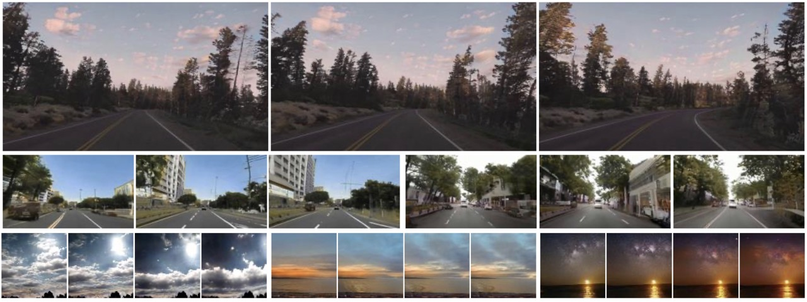

# Towards Smooth Video Composition (ICLR 2023)

[](https://paperswithcode.com/sota/video-generation-on-sky-time-lapse?p=towards-smooth-video-composition)

[](https://paperswithcode.com/sota/video-generation-on-taichi?p=towards-smooth-video-composition)

[](https://paperswithcode.com/sota/video-generation-on-youtube-driving?p=towards-smooth-video-composition)

[Project website](https://genforce.github.io/StyleSV/) |
[Paper](https://openreview.net/pdf?id=W918Ora75q)



## Installation
To install and activate the environment, run the following command:
```
conda env create -f environment.yaml -p env
conda activate ./env
```
The repo is built on top of [StyleGAN-V](https://github.com/universome/stylegan-v), so make sure that it runs on your system.

## Training

### Dataset structure
The dataset should be either a `.zip` archive (the default setting) or a directory structured as:
```
dataset/
    video1/
        - frame1.jpg
        - frame2.jpg
        - ...
    video2/
        - frame1.jpg
        - frame2.jpg
        - ...
    ...
```
We use such frame-wise structure because it makes loading faster for sparse training.

By default, we assume that the data is packed into a `.zip` archive since such representation is useful to avoid additional overhead when copying data between machines on a cluster.
You can also train from a directory: for this, just remove the `.zip` suffix from the `dataset.path` property in `configs/dataset/base.yaml`.

If  you want to train on a custom dataset, then create a config for it here `configs/dataset/my_dataset_config_name.yaml` (see `configs/dataset/ffs.yaml` as an example).
The `fps` parameter is needed for visualizations purposes only, videos typically have the value of 25 or 30 FPS.

### Training StyleSV

StyleSV first pretrains an image generation model, and then fine-tunes to get a video generator. 

To pretrain on YouTube Driving dataset, run:

```
bash scripts/ytb_pretrain.sh
```

To finetune on YouTube Driving dataset, run:
```
bash scripts/ytb_finetune.sh
```
Remember to replace `${YOURPATH}$` with your own file path.

If you do not want `hydra` to create some log directories (typically, you don't), add the following arguments: `hydra.output_subdir=null hydra/job_logging=disabled hydra/hydra_logging=disabled`.

In case [slurm](https://slurm.schedmd.com/documentation.html) is installed on your system, you can submit the slurm job with the above training by adding `slurm=true` parameter.
Sbatch arguments are specified in `configs/infra.yaml`, you can update them with your required ones.
Also note that you can create your own environment in `configs/env`.

### Resume training
If you shut down your experiment at some point and would love to fully recover training (i.e., with the optimizer parameters, logging, etc.), the add `training.resume=latest` argument to your launch script, e.g.:
```
python src/infra/launch.py hydra.run.dir=. exp_suffix=my_experiment_name env=local dataset=ffs dataset.resolution=256 num_gpus=4 training.resume=latest
```
It will locate the given experiment directory (note that the git hash and the `exp_suffix` must be the same) and resume the training from it.

### Inference
To sample from the model, launch the following command:
```
python src/scripts/generate.py --network_pkl /path/to/network-snapshot.pkl --num_videos 25 --as_grids true --save_as_mp4 true --fps 25 --video_len 128 --batch_size 25 --outdir /path/to/output/dir --truncation_psi 0.9
```
This will sample 25 videos of 25 FPS as a 5x5 grid with the truncation factor of 0.9. Each video consists of 128 frames. Adjust the corresponding arguments to change the settings.
Here, we provide a [checkpoint](https://www.dropbox.com/s/63qug26elmz5zqe/ytb_driving_cfg_d.pkl?dl=0) trained on YouTube Driving dataset.

To sample content/motion decomposition grids, use `--moco_decomposition 1` by running the following command:

```
python src/scripts/generate.py --networks_dir PATH_TO_EXPERIMENT/output --num_videos 25 --as_grids true --save_as_mp4 true --fps 25 --video_len 128 --batch_size 25 --outdir tmp --truncation_psi 0.8 --moco_decomposition 1
```

## Data

Datasets can be downloaded here:
- SkyTimelapse: https://github.com/weixiong-ur/mdgan
- Taichi: https://github.com/AliaksandrSiarohin/video-preprocessing
- YouTube Driving: https://metadriverse.github.io/ACO/

## License

This repo is built on top of [StyleGAN-V](https://github.com/universome/stylegan-v), which is likely to be restricted by the [NVidia license](https://nvlabs.github.io/stylegan2-ada-pytorch/license.html) since it's built on top of [StyleGAN2-ADA](https://github.com/nvlabs/stylegan2-ada).
If that's the case, then this repo is also restricted by it.

## Bibtex

```
@article{zhang2022towards,
  title={Towards Smooth Video Composition},
  author={Zhang, Qihang and Yang, Ceyuan and Shen, Yujun and Xu, Yinghao and Zhou, Bolei},
  journal={International Conference on Learning Representations (ICLR)},
  year={2023}
}
```
